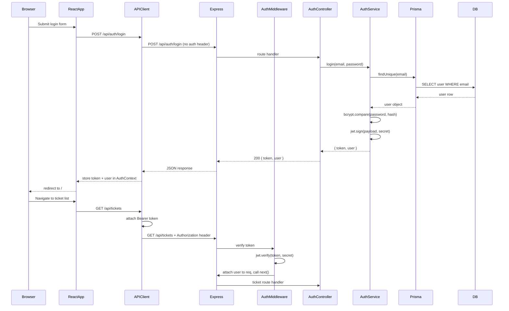

# Design Document: JWT Authentication

## Overview

This design adds JWT-based authentication to the Support Ticket Management System. The system currently has no authentication — all API endpoints are open. This feature introduces:

1. Password hashing for user records (bcrypt)
2. A login endpoint that verifies credentials and issues a signed JWT
3. Middleware that verifies the JWT on all `/api/tickets` routes
4. Role-based authorization restricting status transitions to ADMIN users
5. A React login page with in-memory token storage
6. Automatic token attachment in the existing API client
7. Frontend route protection via a guard component

The design integrates with the existing layered architecture (routes → controllers → services → Prisma) and the existing config module, error classes, and Zod validation patterns.

## Architecture



### Component Diagram

```mermaid
graph TD
    subgraph Frontend
        LP[LoginPage]
        AC[AuthContext]
        PG[ProtectedRoute]
        CLI[API Client]
    end

    subgraph Backend
        AR[Auth Routes]
        AM[Auth Middleware]
        RBAC[Role Guard]
        ACT[Auth Controller]
        AS[Auth Service]
        CFG[Config Module]
    end

    subgraph Database
        USR[User table + password field]
    end

    LP -->|login()| AC
    AC -->|getToken()| CLI
    PG -->|isAuthenticated| AC
    CLI -->|Bearer token| AM
    AR --> ACT --> AS
    AM -->|decoded user| RBAC
    AS -->|bcrypt + jwt| CFG
    AS -->|findUser| USR
```

## Components and Interfaces

### Backend Components

#### 1. Config Module Extension (`server/src/config/index.ts`)

Extends the existing config module to include JWT settings.

```typescript
export const config = {
  // ...existing fields
  jwt: {
    secret: requiredEnvMinLength('JWT_SECRET', 32),
    expiresIn: requiredEnv('JWT_EXPIRES_IN'),
  },
};
```

- `requiredEnvMinLength(key, min)` — reads the env var, throws if missing/empty or shorter than `min` characters.
- Application terminates on startup if JWT_SECRET or JWT_EXPIRES_IN are missing/empty, or if JWT_SECRET < 32 chars.

#### 2. Auth Schema (`server/src/schemas/authSchemas.ts`)

Zod schema for login request validation:

```typescript
import { z } from 'zod';

export const loginSchema = z.object({
  email: z.string().min(1, 'Email is required').email('Email must be a valid email address'),
  password: z.string().min(1, 'Password is required'),
});

export type LoginInput = z.infer<typeof loginSchema>;
```

#### 3. Auth Service (`server/src/services/authService.ts`)

Business logic for authentication:

```typescript
interface LoginResult {
  token: string;
  user: { id: string; name: string; email: string; role: string };
}

async function login(email: string, password: string): Promise<LoginResult>;
```

- Looks up user by email via Prisma
- Compares password against stored bcrypt hash using `bcrypt.compare()`
- On match: signs a JWT with `{ id, email, role }` claims, returns token + user object
- On mismatch or user-not-found: throws `AuthenticationError` (401)

#### 4. Auth Controller (`server/src/controllers/authController.ts`)

Express handler that validates input and delegates to AuthService:

```typescript
async function login(req: Request, res: Response, next: NextFunction): Promise<void>;
```

#### 5. Auth Routes (`server/src/routes/authRoutes.ts`)

```typescript
router.post('/auth/login', validate(loginSchema), authController.login);
```

Mounted on `/api` prefix in `app.ts` — no auth middleware applied.

#### 6. Auth Middleware (`server/src/middleware/authMiddleware.ts`)

```typescript
function authenticate(req: Request, res: Response, next: NextFunction): void;
```

- Extracts `Authorization: Bearer <token>` header
- Verifies token with `jwt.verify(token, config.jwt.secret)`
- On success: attaches `{ id, email, role }` to `req.user`, calls `next()`
- On failure: returns 401 with appropriate error message (missing, expired, or invalid)
- Does NOT modify `req.body` or `req.query`

#### 7. Role Guard Middleware (`server/src/middleware/roleGuard.ts`)

```typescript
function requireRole(...roles: Role[]): RequestHandler;
```

- Checks `req.user.role` against allowed roles
- Returns 403 if role is not in the allowed set
- Applied specifically to `PATCH /api/tickets/:id/status` requiring `ADMIN` role

#### 8. Error Classes Extension (`server/src/errors/index.ts`)

```typescript
export class AuthenticationError extends AppError {
  constructor(message: string = 'Invalid email or password') {
    super(401, 'AUTHENTICATION_ERROR', message);
  }
}

export class ForbiddenError extends AppError {
  constructor(message: string = 'Insufficient permissions') {
    super(403, 'FORBIDDEN', message);
  }
}
```

#### 9. Prisma Schema Update

Add `password` field to `User` model:

```prisma
model User {
  // ...existing fields
  password  String  @db.VarChar(72)  // bcrypt output is 60 chars, 72 gives headroom
}
```

#### 10. Seed Script Update (`server/prisma/seed.ts`)

- Import `bcrypt`
- Hash each user's password with cost factor 10 before insert
- If hashing fails, terminate without inserting and log the error
- Default passwords for seeded users (e.g., `"password123"` — development only)

### Frontend Components

#### 11. Auth Context (`client/src/contexts/AuthContext.tsx`)

```typescript
interface AuthContextValue {
  token: string | null;
  user: UserProfile | null;
  isAuthenticated: boolean;
  login: (token: string, user: UserProfile) => void;
  logout: () => void;
}

interface UserProfile {
  id: string;
  name: string;
  email: string;
  role: string;
}
```

- Uses `useState` for token and user — memory only, no localStorage/sessionStorage
- Wraps the entire app in `<AuthProvider>`
- Token is lost on refresh (by design)

#### 12. Login Page (`client/src/pages/LoginPage.tsx`)

- Route: `/login`
- Email input (`type="email"`, max 254 chars)
- Password input (`type="password"`, max 128 chars)
- Submit button labeled "Login"
- Client-side validation: required fields, email format
- On success: calls `authContext.login(token, user)`, redirects to `/`
- On error: displays error message, preserves email
- Loading state: disables button, shows spinner

#### 13. Protected Route Component (`client/src/components/ProtectedRoute.tsx`)

```typescript
function ProtectedRoute({ children }: { children: React.ReactNode }): JSX.Element;
```

- If `isAuthenticated` is false, redirect to `/login`
- If authenticated, render children
- Does NOT render protected content before redirect

#### 14. API Client Update (`client/src/api/client.ts`)

- Accept a token getter function (from AuthContext)
- If token present: add `Authorization: Bearer <token>` to all `/api/tickets` requests
- If token absent: omit the header
- On 401 response: clear token, redirect to `/login`, reject with session-expired error
- Do NOT add auth header to `/api/auth/login` requests

## Data Models

### User Model (Updated)

| Field     | Type     | Constraints                    |
|-----------|----------|-------------------------------|
| id        | UUID     | PK, auto-generated            |
| name      | String   | Required                      |
| email     | String   | Required, unique              |
| password  | String   | Required, VarChar(72), bcrypt hash |
| role      | Role     | ADMIN \| AGENT                |
| createdAt | DateTime | Auto-generated                |

### JWT Token Payload

| Claim | Type   | Description           |
|-------|--------|-----------------------|
| id    | string | User UUID             |
| email | string | User email            |
| role  | string | "ADMIN" or "AGENT"    |
| iat   | number | Issued-at (auto)      |
| exp   | number | Expiry (from config)  |

### Login Response Shape

```json
{
  "token": "eyJhbGciOiJIUzI1NiIs...",
  "user": {
    "id": "uuid",
    "name": "Alice Admin",
    "email": "alice@example.com",
    "role": "ADMIN"
  }
}
```

### Express Request Extension

```typescript
declare global {
  namespace Express {
    interface Request {
      user?: {
        id: string;
        email: string;
        role: string;
      };
    }
  }
}
```


## Correctness Properties

*A property is a characteristic or behavior that should hold true across all valid executions of a system — essentially, a formal statement about what the system should do. Properties serve as the bridge between human-readable specifications and machine-verifiable correctness guarantees.*

### Property 1: Bcrypt hashing produces valid hashes

*For any* plaintext password string (1–72 bytes), hashing it with bcrypt at cost factor 10 SHALL produce a 60-character string beginning with a recognized bcrypt prefix (e.g., `$2b$10$`).

**Validates: Requirements 1.2**

### Property 2: Login token-response consistency

*For any* valid user in the database, when login succeeds, the `user` object in the response (id, email, role) SHALL exactly match the corresponding claims decoded from the returned JWT token.

**Validates: Requirements 2.1, 2.7**

### Property 3: Invalid email format rejection

*For any* string that is not a valid email format (missing `@`, missing domain, etc.), submitting it as the email field to the login endpoint SHALL result in a 400 response with a validation error, never a 401 or 200.

**Validates: Requirements 2.6**

### Property 4: Valid token decode correctness

*For any* JWT signed with the application's secret and containing `{ id, email, role }` claims that has not expired, the auth middleware SHALL decode it and attach an object with matching `id`, `email`, and `role` values to the request.

**Validates: Requirements 4.1**

### Property 5: Invalid token rejection

*For any* string that is not a validly-signed JWT (random strings, tampered tokens, tokens signed with a different secret), the auth middleware SHALL reject it with a 401 status and SHALL NOT attach any user object to the request.

**Validates: Requirements 4.4**

### Property 6: Middleware preserves request body and query

*For any* request body object and query parameter set, after the auth middleware processes a valid token, the `req.body` and `req.query` SHALL be identical to their values before middleware execution.

**Validates: Requirements 4.7**

### Property 7: Role restriction scoped exclusively to status PATCH

*For any* authenticated user with the AGENT role, requests to any ticket endpoint OTHER than `PATCH /api/tickets/:id/status` SHALL NOT be rejected with 403. Only `PATCH /api/tickets/:id/status` SHALL enforce the ADMIN role requirement.

**Validates: Requirements 5.2, 5.3, 5.4, 5.5, 5.6, 5.7**

### Property 8: Authorization header presence equals token presence

*For any* outgoing API request to a `/api/tickets` path, the Authorization header SHALL be present with value `"Bearer <token>"` if and only if a non-null token exists in the AuthContext. When token is null, the header SHALL be absent.

**Validates: Requirements 8.1, 8.2**

### Property 9: Unauthenticated route protection

*For any* protected route path (`/`, `/tickets/new`, `/tickets/:id`), when no token is present in AuthContext, navigating to that path SHALL result in a redirect to `/login` without rendering any protected page content.

**Validates: Requirements 9.1, 9.3**

## Error Handling

### Backend Error Responses

All errors follow the existing `AppError` pattern and are caught by the global `errorHandler` middleware.

| Scenario | Status | Code | Message |
|----------|--------|------|---------|
| Invalid credentials (wrong email or password) | 401 | AUTHENTICATION_ERROR | "Invalid email or password" |
| Missing Authorization header | 401 | AUTHENTICATION_ERROR | "Authentication required" |
| Expired token | 401 | AUTHENTICATION_ERROR | "Token expired" |
| Invalid/malformed token | 401 | AUTHENTICATION_ERROR | "Invalid token" |
| Insufficient role (AGENT on status PATCH) | 403 | FORBIDDEN | "Only ADMIN users can change ticket status" |
| Login validation (missing/invalid fields) | 400 | VALIDATION_ERROR | Field-specific messages via Zod |
| Missing JWT_SECRET on startup | — | Process exits with logged error | "JWT_SECRET is required" |
| JWT_SECRET too short on startup | — | Process exits with logged error | "JWT_SECRET must be at least 32 characters" |
| Missing JWT_EXPIRES_IN on startup | — | Process exits with logged error | "JWT_EXPIRES_IN is required" |

### New Error Classes

```typescript
// Added to server/src/errors/index.ts
export class AuthenticationError extends AppError {
  constructor(message: string = 'Invalid email or password') {
    super(401, 'AUTHENTICATION_ERROR', message);
    this.name = 'AuthenticationError';
    Object.setPrototypeOf(this, AuthenticationError.prototype);
  }
}

export class ForbiddenError extends AppError {
  constructor(message: string = 'Insufficient permissions') {
    super(403, 'FORBIDDEN', message);
    this.name = 'ForbiddenError';
    Object.setPrototypeOf(this, ForbiddenError.prototype);
  }
}
```

### Frontend Error Handling

| Scenario | Behavior |
|----------|----------|
| Login returns 401 | Show "Invalid email or password" on form |
| Login returns 400 | Show field-specific validation errors |
| Network failure during login | Show "Server is unavailable" message, re-enable button |
| Any API returns 401 (session expired) | Clear AuthContext, redirect to /login |
| Client-side validation failure | Prevent submission, show inline messages |

### Token Expiry Strategy

- No token refresh mechanism in this iteration
- On expiry, next API call receives 401 → user is redirected to login
- Frontend does NOT decode the token locally to check expiry

## Testing Strategy

### Backend Testing (Jest + Supertest)

#### Unit Tests
- **Auth Service**: test login success, wrong email, wrong password, bcrypt comparison
- **Auth Middleware**: test valid token, expired token, malformed token, missing header
- **Role Guard**: test ADMIN allowed, AGENT blocked, middleware ordering
- **Config validation**: test missing env vars, short secret

#### Integration Tests (Supertest)
- Full login flow: POST /api/auth/login → receive token → use on protected route
- RBAC: AGENT can GET/POST tickets but cannot PATCH status
- Protected routes return 401 without token
- Login endpoint accessible without token

#### Property-Based Tests (fast-check)

The project already has `fast-check` as a dev dependency. Each property test will:
- Run a minimum of 100 iterations
- Be tagged with a comment referencing the design property
- Use `fast-check` arbitrary generators for input generation

Properties to implement:
1. **Property 1** — Generate random passwords (1–72 bytes), hash, verify format
2. **Property 2** — Generate random user records, login, decode token, verify claim match
3. **Property 3** — Generate random non-email strings, verify 400 rejection
4. **Property 4** — Generate tokens with random valid payloads, verify middleware decode
5. **Property 5** — Generate random non-JWT strings, verify middleware rejects all
6. **Property 6** — Generate random body/query objects, pass through middleware, verify unchanged
7. **Property 7** — Generate requests to non-status-PATCH endpoints as AGENT, verify no 403
8. **Property 8** — Generate random tokens and paths, verify header attachment logic
9. **Property 9** — Generate random protected route paths, verify redirect when unauthenticated

Tag format example:
```typescript
// Feature: jwt-auth, Property 2: For any valid user, login response user object matches decoded JWT claims
```

### Frontend Testing (Vitest + React Testing Library)

#### Unit Tests
- AuthContext: login stores values, logout clears, isAuthenticated derived correctly
- LoginPage: renders form, validates inputs, handles errors, shows loading state
- ProtectedRoute: redirects when unauthenticated, renders when authenticated
- API Client: attaches header when token present, omits when absent, handles 401

#### Property-Based Tests (fast-check)
- **Property 8** — API client header attachment logic
- **Property 9** — Route protection across all protected paths

### New Dependencies Required

**Backend (server/package.json):**
- `bcrypt` — password hashing
- `jsonwebtoken` — JWT sign/verify
- `@types/bcrypt` — TypeScript types (devDependency)
- `@types/jsonwebtoken` — TypeScript types (devDependency)

**Frontend (client/package.json):**
- No new runtime dependencies (uses existing React, React Router, fetch)

### Test File Locations (co-located with source)

```
server/src/services/authService.test.ts
server/src/middleware/authMiddleware.test.ts
server/src/middleware/roleGuard.test.ts
server/src/config/index.test.ts
server/tests/auth.integration.test.ts
client/src/contexts/AuthContext.test.tsx
client/src/pages/LoginPage.test.tsx
client/src/components/ProtectedRoute.test.tsx
client/src/api/client.test.ts
```
