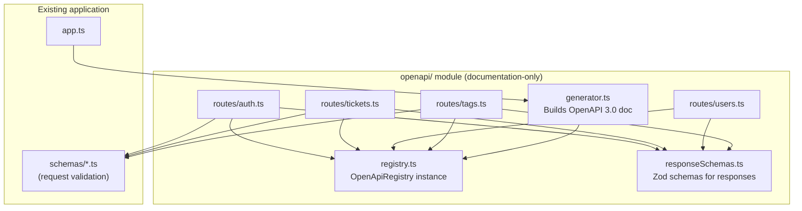

# Design Document: OpenAPI Documentation

## Overview

This design adds interactive OpenAPI 3.0 documentation to the Express backend using `@asteasolutions/zod-to-openapi` to derive the spec from existing Zod request schemas and new response schemas. The documentation is served at `/api-docs` via `swagger-ui-express`, accessible without authentication.

The openapi module is **read-only** relative to the rest of the application — it imports schemas and configuration but exports nothing that runtime routes depend on. This means the documentation layer can be removed or disabled without affecting application behavior.

## Architecture



### File Structure

```
server/src/openapi/
├── registry.ts          # Creates and exports the OpenApiRegistry + registers security scheme
├── responseSchemas.ts   # Zod schemas describing all response bodies
├── generator.ts         # Generates OpenAPI 3.0 JSON from the registry
└── routes/
    ├── auth.ts          # Registers POST /api/auth/login
    ├── tickets.ts       # Registers ticket + comment endpoints (7 routes)
    ├── users.ts         # Registers GET /api/users
    └── tags.ts          # Registers tag endpoints (3 routes)
```

### Data Flow at Startup

1. `registry.ts` creates an `OpenAPIRegistry` instance and registers the Bearer security scheme.
2. Each `routes/*.ts` file imports the registry, imports existing request schemas + response schemas, and calls `registry.registerPath(...)` for each endpoint.
3. `generator.ts` imports the registry, calls `OpenApiGeneratorV3.generateDocument(...)`, and exports the resulting JSON document.
4. `app.ts` imports the generated document and mounts `swagger-ui-express` at `/api-docs` **before** any auth middleware.

## Components and Interfaces

### registry.ts

```typescript
import { OpenAPIRegistry } from '@asteasolutions/zod-to-openapi';

export const registry = new OpenAPIRegistry();

// Register Bearer auth security scheme
registry.registerComponent('securitySchemes', 'BearerAuth', {
  type: 'http',
  scheme: 'bearer',
  bearerFormat: 'JWT',
});
```

**Responsibilities:**
- Single registry instance shared across all route registration files
- Defines the `BearerAuth` security scheme used by protected endpoints

### responseSchemas.ts

Defines documentation-only Zod schemas for all API responses. These are NOT used at runtime for validation — they describe what the API actually returns based on the Prisma model and service layer.

```typescript
import { z } from 'zod';
import { extendZodWithOpenApi } from '@asteasolutions/zod-to-openapi';

extendZodWithOpenApi(z);

// Shared user subset (returned in responses)
export const UserResponseSchema = z.object({
  id: z.string().uuid(),
  name: z.string(),
  email: z.string().email(),
  role: z.enum(['ADMIN', 'AGENT']),
}).openapi('UserResponse');

// Login response
export const LoginResponseSchema = z.object({
  token: z.string(),
  user: z.object({
    id: z.string().uuid(),
    name: z.string(),
    email: z.string().email(),
    role: z.string(),
  }),
}).openapi('LoginResponse');

// Tag response
export const TagResponseSchema = z.object({
  id: z.string().uuid(),
  name: z.string(),
  createdAt: z.string().datetime(),
}).openapi('TagResponse');

// Comment response
export const CommentResponseSchema = z.object({
  id: z.string().uuid(),
  body: z.string(),
  ticketId: z.string().uuid(),
  authorId: z.string().uuid(),
  createdAt: z.string().datetime(),
  author: UserResponseSchema,
}).openapi('CommentResponse');

// Ticket response (single)
export const TicketResponseSchema = z.object({
  id: z.string().uuid(),
  title: z.string(),
  description: z.string(),
  status: z.enum(['OPEN', 'IN_PROGRESS', 'RESOLVED', 'CLOSED', 'CANCELLED']),
  priority: z.enum(['LOW', 'MEDIUM', 'HIGH', 'URGENT']),
  createdBy: z.string().uuid(),
  assignedTo: z.string().uuid().nullable(),
  createdAt: z.string().datetime(),
  updatedAt: z.string().datetime(),
  creator: UserResponseSchema,
  assignee: UserResponseSchema.nullable(),
  tags: z.array(TagResponseSchema),
  comments: z.array(CommentResponseSchema).optional(),
  validTransitions: z.array(z.enum(['OPEN', 'IN_PROGRESS', 'RESOLVED', 'CLOSED', 'CANCELLED'])),
}).openapi('TicketResponse');

// Paginated ticket list response
export const TicketListResponseSchema = z.object({
  data: z.array(TicketResponseSchema.omit({ comments: true })),
  pagination: z.object({
    page: z.number().int(),
    pageSize: z.number().int(),
    total: z.number().int(),
    totalPages: z.number().int(),
  }),
}).openapi('TicketListResponse');

// Shared error response
export const ErrorResponseSchema = z.object({
  error: z.object({
    code: z.string(),
    message: z.string(),
    details: z.array(z.object({
      field: z.string(),
      message: z.string(),
    })).optional(),
  }),
}).openapi('ErrorResponse');

// Health check response
export const HealthResponseSchema = z.object({
  status: z.literal('ok'),
}).openapi('HealthResponse');
```

### generator.ts

```typescript
import { OpenApiGeneratorV3 } from '@asteasolutions/zod-to-openapi';
import { registry } from './registry';
import './routes/auth';
import './routes/tickets';
import './routes/users';
import './routes/tags';

export function generateOpenApiDocument() {
  const generator = new OpenApiGeneratorV3(registry.definitions);
  return generator.generateDocument({
    openapi: '3.0.0',
    info: {
      title: 'Support Ticket Management API',
      version: '1.0.0',
      description: 'Internal API for managing support tickets, users, comments, and tags.',
    },
    servers: [{ url: '/api', description: 'API server' }],
  });
}
```

### routes/auth.ts (example pattern)

```typescript
import { registry } from '../registry';
import { loginSchema } from '../../schemas/authSchemas';
import { LoginResponseSchema, ErrorResponseSchema } from '../responseSchemas';

// Extend Zod schemas for OpenAPI metadata
loginSchema.openapi('LoginRequest');

registry.registerPath({
  method: 'post',
  path: '/auth/login',
  summary: 'Authenticate user',
  request: { body: { content: { 'application/json': { schema: loginSchema } } } },
  responses: {
    200: { description: 'Login successful', content: { 'application/json': { schema: LoginResponseSchema } } },
    401: { description: 'Invalid credentials', content: { 'application/json': { schema: ErrorResponseSchema } } },
  },
});
```

### app.ts modification

```typescript
import swaggerUi from 'swagger-ui-express';
import { generateOpenApiDocument } from './openapi/generator';

const app = express();
app.use(cors());
app.use(express.json());

// Mount Swagger UI BEFORE auth-protected routes
const openApiDocument = generateOpenApiDocument();
app.use('/api-docs', swaggerUi.serve, swaggerUi.setup(openApiDocument));

// ...existing routes
```

## Data Models

### OpenAPI Security Scheme

| Field | Value |
|-------|-------|
| type | `http` |
| scheme | `bearer` |
| bearerFormat | `JWT` |

### Route Registration Matrix

| Endpoint | Method | Auth | Path Params | Query Params | Request Body | Success Code |
|----------|--------|------|-------------|--------------|--------------|--------------|
| /api/auth/login | POST | No | — | — | loginSchema | 200 |
| /api/users | GET | Yes | — | — | — | 200 |
| /api/tickets | POST | Yes | — | — | createTicketSchema | 201 |
| /api/tickets | GET | Yes | — | listTicketsQuerySchema | — | 200 |
| /api/tickets/:id | GET | Yes | uuidParamSchema | — | — | 200 |
| /api/tickets/:id | PATCH | Yes | uuidParamSchema | — | updateTicketSchema | 200 |
| /api/tickets/:id/status | PATCH | Yes | uuidParamSchema | — | changeStatusSchema | 200 |
| /api/tickets/:id/comments | POST | Yes | uuidParamSchema | — | createCommentSchema | 201 |
| /api/tags | POST | Yes | — | — | createTagSchema | 201 |
| /api/tags | GET | Yes | — | — | — | 200 |
| /api/tags/:id | DELETE | Yes | deleteTagParamsSchema | — | — | 204 |
| /api/health | GET | No | — | — | — | 200 |

### Error Response Mapping

| Error Code | HTTP Status | Applicable Endpoints |
|------------|-------------|---------------------|
| VALIDATION_ERROR | 400 | All endpoints with request bodies or query params |
| AUTHENTICATION_ERROR | 401 | All authenticated endpoints |
| FORBIDDEN | 403 | PATCH /tickets/:id/status (ADMIN only) |
| TICKET_LOCKED | 403 | PATCH /tickets/:id, PATCH /tickets/:id/status |
| NOT_FOUND | 404 | All endpoints with :id path params |
| INVALID_TRANSITION | 409 | PATCH /tickets/:id/status |
| CONFLICT | 409 | POST /api/tags (duplicate name) |

## Correctness Properties

*A property is a characteristic or behavior that should hold true across all valid executions of a system — essentially, a formal statement about what the system should do. Properties serve as the bridge between human-readable specifications and machine-verifiable correctness guarantees.*

### Property 1: Schema fidelity

*For any* Zod schema field registered with the OpenAPI registry, the generated OpenAPI JSON SHALL preserve its constraints (minLength, maxLength, enum values, format) and SHALL mark optional fields as not appearing in the "required" array.

**Validates: Requirements 1.2, 1.3**

### Property 2: Error documentation completeness

*For any* endpoint registered in the OpenAPI registry that documents error response codes (400, 401, 403, 404, 409), each error code's response content SHALL reference the shared ErrorResponse schema.

**Validates: Requirements 2.3**

### Property 3: Route parameter documentation completeness

*For any* route registered in the OpenAPI registry, all path parameters SHALL be documented with their type and format constraints, all query parameters SHALL be documented with their type and enum values, and all request bodies SHALL reference a registered Zod schema rather than an inline definition.

**Validates: Requirements 3.2, 3.3, 3.4**

### Property 4: Security scheme application consistency

*For any* endpoint that requires authentication (all endpoints except POST /api/auth/login and GET /api/health), the generated OpenAPI spec SHALL include the BearerAuth security requirement on that endpoint's definition.

**Validates: Requirements 4.2, 4.4**

## Error Handling

### Generation Errors

The OpenAPI document is generated once at startup. If schema registration or document generation throws (e.g., a schema is malformed), the error propagates to the startup sequence and prevents the server from starting. This is intentional — a broken doc means something is wrong with schema definitions.

### Runtime Behavior

- `/api-docs` serves static HTML + the generated JSON. No runtime errors are expected beyond standard Express static serving.
- The openapi module never touches request/response flow for actual API calls.

### Graceful Degradation

If `swagger-ui-express` or `@asteasolutions/zod-to-openapi` is unavailable (e.g., in a minimal production build), the `/api-docs` route simply won't be mounted. The rest of the application continues unaffected.

## Testing Strategy

### Property-Based Tests (fast-check)

The project already uses `fast-check` (in devDependencies). Property tests will validate the four correctness properties above by generating Zod schemas with various configurations and verifying the OpenAPI output.

- **Library:** fast-check (already installed)
- **Minimum iterations:** 100 per property
- **Tag format:** `Feature: openapi-docs, Property N: <property text>`

Each correctness property will have a dedicated property-based test that:
1. Generates random Zod schemas with varying constraints (min, max, optional, enum, uuid format)
2. Registers them in a fresh registry
3. Generates the OpenAPI document
4. Asserts the property holds across all generated inputs

### Unit Tests (Jest)

Example-based tests for specific response schema shapes and configuration:
- Login response schema has `token` and `user` fields (Req 2.4)
- Ticket response schema has all model fields + nested relations (Req 2.5)
- Paginated response has `data` array and `pagination` envelope (Req 2.6)
- Bearer security scheme is correctly defined (Req 4.1)
- All 12 routes are registered (Req 3.1)
- Status endpoint description contains valid transitions (Req 6.1)
- Status endpoint has 409 response documented (Req 6.2)
- Registry references same schema instances as route middleware (Req 7.1)

### Integration Tests (Supertest)

- `GET /api-docs` returns 200 with HTML content without auth token (Req 5.1, 5.4)
- Generated document validates against OpenAPI 3.0 specification (Req 5.2)

### Test Configuration

```
Property tests: 100 iterations minimum
Unit tests: Jest (existing framework)
Integration tests: Supertest (existing framework)
Test file location: server/src/openapi/__tests__/
```
