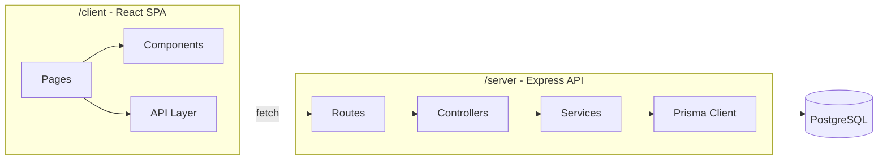
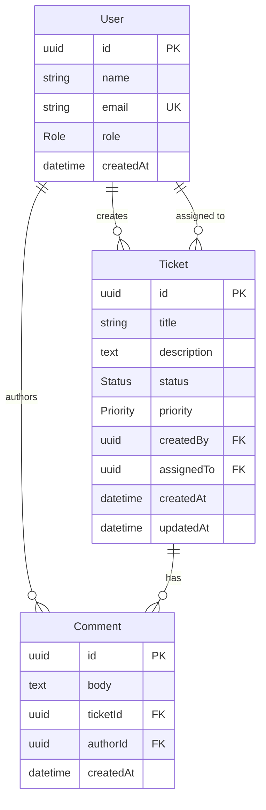
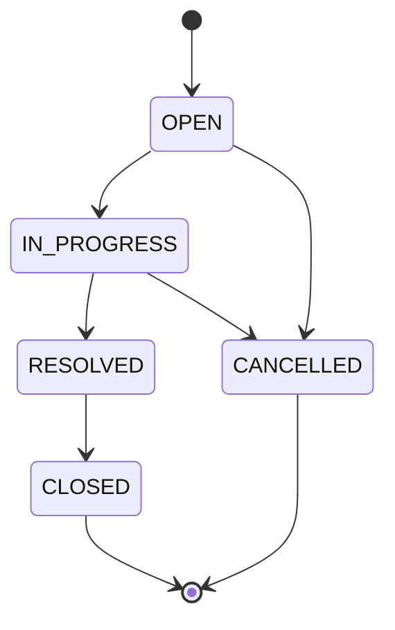
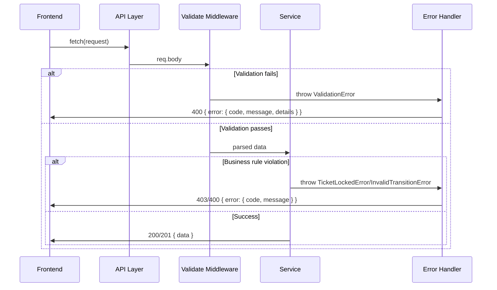

# Design Document: Support Ticket Core

## Overview

This document describes the technical design for the core Support Ticket Management feature — a full-stack system enabling internal staff to create, view, update, search, and progress support tickets through a fixed status lifecycle. The system enforces strict state-machine transitions via a single `Record<Status, Status[]>` transitions map, validates all inputs server-side with Zod, locks terminal-state tickets from field edits, and surfaces structured errors to a React frontend.

The architecture follows a monorepo layout with an Express/TypeScript backend (`/server`) and a React/TypeScript frontend (`/client`). The backend uses Prisma ORM against PostgreSQL with **native PG enums** for Status and Priority. A GIN trigram index on title+description powers efficient keyword search. All API errors follow one consistent `ApiErrorResponse` shape.

## Architecture



### Layering Rules

**Backend (server/):**
- `routes/` — Express Router definitions, attach validation middleware
- `controllers/` — Extract request data, call services, format HTTP responses
- `services/` — Business logic, state-machine enforcement, Prisma calls
- `middleware/` — Zod validation middleware, error handler middleware
- `schemas/` — Zod validation schemas
- `config/` — Single config module for all environment variables
- `errors/` — Custom error classes

**Frontend (client/):**
- `src/pages/` — Route-level page components (TicketListPage, TicketDetailPage, CreateTicketPage)
- `src/components/` — Reusable UI components (TicketCard, CommentList, StatusBadge, ErrorDisplay)
- `src/api/` — Typed fetch wrappers for each backend endpoint

### Key Design Decisions

1. **State machine as a single source-of-truth transitions map** — Valid transitions are defined as a `Record<Status, Status[]>` constant in the service layer. Both the status-change endpoint AND any "valid next states" hint reuse this same map. An exported `getValidTransitions(currentStatus)` function allows the frontend (via API response) to know which buttons to render.
2. **Terminal state lock at the service layer** — The service checks terminal state before any field update, returning a distinct `TICKET_LOCKED` error code.
3. **Zod validation as Express middleware** — A generic `validate` middleware wraps Zod parsing and formats 400 responses consistently.
4. **Native PostgreSQL enums** — Status and Priority are Prisma enums mapping to native PG `CREATE TYPE` statements.
5. **GIN trigram index for keyword search** — A `pg_trgm`-based GIN index on title+description supports efficient `ILIKE '%keyword%'` queries without sequential scans.
6. **One consistent error response shape** — Every endpoint returns the same `ApiErrorResponse` structure on failure.

## Components and Interfaces

### Consistent Error Response Shape

All API error responses — across every endpoint — follow this single shape:

```typescript
interface ApiErrorResponse {
  error: {
    code: string;      // e.g. "VALIDATION_ERROR", "TICKET_LOCKED", "NOT_FOUND", "INVALID_TRANSITION"
    message: string;   // Human-readable
    details?: Array<{ field: string; message: string }>;  // Per-field errors from Zod
  };
}
```

This is the ONLY error format the backend ever returns. The frontend can rely on parsing this shape for all non-2xx responses.

### State Machine (`server/src/services/stateMachine.ts`)

The state machine is a **single source-of-truth** — one constant map that both the status-change logic and the "valid next states" API hint consume:

```typescript
import { Status } from '@prisma/client';

/** Single source-of-truth for all valid status transitions */
export const VALID_TRANSITIONS: Record<Status, Status[]> = {
  OPEN: [Status.IN_PROGRESS, Status.CANCELLED],
  IN_PROGRESS: [Status.RESOLVED, Status.CANCELLED],
  RESOLVED: [Status.CLOSED],
  CLOSED: [],
  CANCELLED: [],
};

export const TERMINAL_STATES: Status[] = [Status.CLOSED, Status.CANCELLED];

export function isValidTransition(from: Status, to: Status): boolean {
  return VALID_TRANSITIONS[from].includes(to);
}

export function isTerminalState(status: Status): boolean {
  return TERMINAL_STATES.includes(status);
}

/**
 * Returns the list of valid next statuses from the given status.
 * Used by the status-change endpoint for validation AND
 * included in ticket responses so the frontend knows which buttons to show.
 */
export function getValidTransitions(currentStatus: Status): Status[] {
  return VALID_TRANSITIONS[currentStatus];
}
```

### Full REST API Endpoint Specification

All endpoints are under the `/api` prefix. Every error response uses the `ApiErrorResponse` shape defined above.

---

#### POST `/api/tickets` — Create a Ticket

**Request Body:**

```typescript
interface CreateTicketRequest {
  title: string;         // 3–200 chars after trim
  description: string;   // 1–5000 chars after trim
  priority: "LOW" | "MEDIUM" | "HIGH" | "URGENT";
  createdBy: string;     // UUID of existing User
  assignedTo?: string | null;  // UUID of existing User, or null
}
```

**Success Response: `201 Created`**

```typescript
interface CreateTicketResponse {
  id: string;            // Generated UUID
  title: string;
  description: string;
  status: "OPEN";        // Always OPEN on creation
  priority: "LOW" | "MEDIUM" | "HIGH" | "URGENT";
  createdBy: string;
  assignedTo: string | null;
  createdAt: string;     // ISO 8601
  updatedAt: string;     // ISO 8601
  validTransitions: string[];  // e.g. ["IN_PROGRESS", "CANCELLED"]
}
```

**Error Responses:**

| Status | Code | When |
|--------|------|------|
| 400 | `VALIDATION_ERROR` | Missing/invalid fields, title length, description length, invalid priority |
| 400 | `VALIDATION_ERROR` | `createdBy` or `assignedTo` is not a valid UUID format |
| 404 | `NOT_FOUND` | `createdBy` or `assignedTo` UUID does not exist in User table |

---

#### GET `/api/tickets` — List / Search Tickets

**Query Parameters:**

```typescript
interface TicketSearchParams {
  keyword?: string;   // Case-insensitive substring match on title+description
  status?: "OPEN" | "IN_PROGRESS" | "RESOLVED" | "CLOSED" | "CANCELLED";
}
```

**Success Response: `200 OK`**

```typescript
type ListTicketsResponse = Array<{
  id: string;
  title: string;
  description: string;
  status: Status;
  priority: Priority;
  createdBy: string;
  assignedTo: string | null;
  createdAt: string;
  updatedAt: string;
  validTransitions: string[];
  creator: { id: string; name: string; email: string };
  assignee: { id: string; name: string; email: string } | null;
}>;
// Ordered by updatedAt descending
```

**Error Responses:**

| Status | Code | When |
|--------|------|------|
| 400 | `VALIDATION_ERROR` | `status` query param is not a valid Status enum value |

---

#### GET `/api/tickets/:id` — Get Ticket with Comments

**Path Parameters:**
- `id` — UUID of the ticket

**Success Response: `200 OK`**

```typescript
interface GetTicketResponse {
  id: string;
  title: string;
  description: string;
  status: Status;
  priority: Priority;
  createdBy: string;
  assignedTo: string | null;
  createdAt: string;
  updatedAt: string;
  validTransitions: string[];  // From getValidTransitions(status)
  creator: { id: string; name: string; email: string };
  assignee: { id: string; name: string; email: string } | null;
  comments: Array<{
    id: string;
    body: string;
    authorId: string;
    createdAt: string;
    author: { id: string; name: string; email: string };
  }>;  // Ordered by createdAt ascending
}
```

**Error Responses:**

| Status | Code | When |
|--------|------|------|
| 404 | `NOT_FOUND` | Ticket with given ID does not exist |

---

#### PATCH `/api/tickets/:id` — Update Ticket Fields

**Path Parameters:**
- `id` — UUID of the ticket

**Request Body:**

```typescript
interface UpdateTicketRequest {
  title?: string;        // 3–200 chars after trim
  description?: string;  // 1–5000 chars after trim
  priority?: "LOW" | "MEDIUM" | "HIGH" | "URGENT";
  assignedTo?: string | null;  // UUID or null to unassign
}
```

At least one field must be provided.

**Success Response: `200 OK`**

```typescript
interface UpdateTicketResponse {
  id: string;
  title: string;
  description: string;
  status: Status;
  priority: Priority;
  createdBy: string;
  assignedTo: string | null;
  createdAt: string;
  updatedAt: string;        // Refreshed
  validTransitions: string[];
}
```

**Error Responses:**

| Status | Code | When |
|--------|------|------|
| 400 | `VALIDATION_ERROR` | Title/description length violation, invalid priority, invalid UUID format |
| 403 | `TICKET_LOCKED` | Ticket is in CLOSED or CANCELLED status |
| 404 | `NOT_FOUND` | Ticket ID or assignedTo User ID does not exist |

---

#### PATCH `/api/tickets/:id/status` — Change Ticket Status

**Path Parameters:**
- `id` — UUID of the ticket

**Request Body:**

```typescript
interface ChangeStatusRequest {
  status: "OPEN" | "IN_PROGRESS" | "RESOLVED" | "CLOSED" | "CANCELLED";
}
```

**Success Response: `200 OK`**

```typescript
interface ChangeStatusResponse {
  id: string;
  title: string;
  description: string;
  status: Status;       // The new status
  priority: Priority;
  createdBy: string;
  assignedTo: string | null;
  createdAt: string;
  updatedAt: string;    // Refreshed
  validTransitions: string[];  // Valid transitions from NEW status
}
```

**Error Responses:**

| Status | Code | When |
|--------|------|------|
| 400 | `VALIDATION_ERROR` | `status` value is not in Status enum |
| 400 | `INVALID_TRANSITION` | Transition from current status to requested status is not valid |
| 404 | `NOT_FOUND` | Ticket ID does not exist |

**Error JSON Examples — distinguishing `INVALID_TRANSITION` from `VALIDATION_ERROR`:**

A rejected status transition (valid enum value, but disallowed by the state machine):
```json
{
  "error": {
    "code": "INVALID_TRANSITION",
    "message": "Cannot transition from IN_PROGRESS to OPEN. Valid transitions: RESOLVED, CANCELLED"
  }
}
```

A validation error (invalid enum value or malformed input — caught by Zod before hitting the state machine):
```json
{
  "error": {
    "code": "VALIDATION_ERROR",
    "message": "Request validation failed",
    "details": [
      { "field": "status", "message": "Invalid enum value. Expected 'OPEN' | 'IN_PROGRESS' | 'RESOLVED' | 'CLOSED' | 'CANCELLED', received 'BOGUS'" }
    ]
  }
}
```

The frontend distinguishes these by the `code` field: `"INVALID_TRANSITION"` means the value was a real status but the transition is disallowed; `"VALIDATION_ERROR"` (with a `details` array) means the input itself was malformed.

---

#### POST `/api/tickets/:id/comments` — Add Comment

**Path Parameters:**
- `id` — UUID of the ticket

**Request Body:**

```typescript
interface CreateCommentRequest {
  body: string;       // 1–2000 chars after trim
  authorId: string;   // UUID of existing User
}
```

**Success Response: `201 Created`**

```typescript
interface CreateCommentResponse {
  id: string;         // Generated UUID
  body: string;
  ticketId: string;
  authorId: string;
  createdAt: string;  // ISO 8601
  author: { id: string; name: string; email: string };
}
```

**Error Responses:**

| Status | Code | When |
|--------|------|------|
| 400 | `VALIDATION_ERROR` | Body empty/too long after trim, missing authorId, invalid UUID format |
| 404 | `NOT_FOUND` | Ticket ID or authorId does not exist |

Note: Comments are allowed on tickets in ANY status, including CLOSED and CANCELLED.

---

### Backend Components

#### Controllers (`server/src/controllers/`)

```typescript
// ticketController.ts
export async function createTicket(req: Request, res: Response, next: NextFunction): Promise<void>;
export async function listTickets(req: Request, res: Response, next: NextFunction): Promise<void>;
export async function getTicket(req: Request, res: Response, next: NextFunction): Promise<void>;
export async function updateTicket(req: Request, res: Response, next: NextFunction): Promise<void>;
export async function changeStatus(req: Request, res: Response, next: NextFunction): Promise<void>;

// commentController.ts
export async function addComment(req: Request, res: Response, next: NextFunction): Promise<void>;
```

#### Services (`server/src/services/`)

```typescript
// ticketService.ts
export async function createTicket(data: CreateTicketInput): Promise<Ticket>;
export async function listTickets(filters?: TicketFilters): Promise<Ticket[]>;
export async function getTicketById(id: string): Promise<TicketWithComments | null>;
export async function updateTicket(id: string, data: UpdateTicketInput): Promise<Ticket>;
export async function changeTicketStatus(id: string, newStatus: Status): Promise<Ticket>;

// commentService.ts
export async function addComment(data: CreateCommentInput): Promise<Comment>;
// NOTE: addComment writes only to the Comment table — it MUST NOT update the Ticket
// record, so Ticket.updatedAt is unaffected by new comments. Only field updates
// (PATCH /tickets/:id) and status changes (PATCH /tickets/:id/status) touch updatedAt.
```

#### Validation Schemas (`server/src/schemas/`)

```typescript
// ticketSchemas.ts
import { z } from 'zod';
import { Priority, Status } from '@prisma/client';

export const createTicketSchema = z.object({
  title: z.string().trim().min(3).max(200),
  description: z.string().trim().min(1).max(5000),
  priority: z.nativeEnum(Priority),
  createdBy: z.string().uuid(),
  assignedTo: z.string().uuid().nullable().optional(),
});

export const updateTicketSchema = z.object({
  title: z.string().trim().min(3).max(200).optional(),
  description: z.string().trim().min(1).max(5000).optional(),
  priority: z.nativeEnum(Priority).optional(),
  assignedTo: z.string().uuid().nullable().optional(),
});

export const changeStatusSchema = z.object({
  status: z.nativeEnum(Status),
});

export const listTicketsQuerySchema = z.object({
  keyword: z.string().optional(),
  status: z.nativeEnum(Status).optional(),
});

// commentSchemas.ts
export const createCommentSchema = z.object({
  body: z.string().trim().min(1).max(2000),
  authorId: z.string().uuid(),
});
```

#### Validation Middleware (`server/src/middleware/validate.ts`)

```typescript
import { ZodSchema } from 'zod';

export function validate(schema: ZodSchema, source?: 'body' | 'query'): RequestHandler;
```

Parses `req.body` (or `req.query` when `source='query'`) against the given schema. On failure, returns a 400 with `ApiErrorResponse`. On success, replaces the source with parsed/trimmed data and calls `next()`.

#### Error Handler Middleware (`server/src/middleware/errorHandler.ts`)

```typescript
export function errorHandler(err: Error, req: Request, res: Response, next: NextFunction): void;
```

Catches all unhandled errors and formats them into the `ApiErrorResponse` shape. Handles custom error classes.

#### Custom Errors (`server/src/errors/`)

```typescript
export class AppError extends Error {
  constructor(
    public statusCode: number,
    public code: string,
    message: string,
    public details?: Array<{ field: string; message: string }>
  );
}

export class NotFoundError extends AppError {
  // statusCode: 404, code: "NOT_FOUND"
}

export class ValidationError extends AppError {
  // statusCode: 400, code: "VALIDATION_ERROR"
}

export class TicketLockedError extends AppError {
  // statusCode: 403, code: "TICKET_LOCKED"
}

export class InvalidTransitionError extends AppError {
  // statusCode: 400, code: "INVALID_TRANSITION"
}
```

#### Config Module (`server/src/config/index.ts`)

```typescript
export const config = {
  port: number;
  databaseUrl: string;
  nodeEnv: string;
};
```

Reads all `process.env` values once, validates them, and exports a typed config object.

### Frontend Components

#### Pages (`client/src/pages/`)

| Page | Route | Description |
|------|-------|-------------|
| `TicketListPage` | `/` | Displays all tickets with search/filter controls |
| `TicketDetailPage` | `/tickets/:id` | Full ticket view with comments and edit/status controls |
| `CreateTicketPage` | `/tickets/new` | Form to create a new ticket |

#### Reusable Components (`client/src/components/`)

| Component | Purpose |
|-----------|---------|
| `TicketCard` | Compact ticket display for list view (title, status, priority, assignee, updatedAt) |
| `TicketForm` | Shared form for create and edit (title, description, priority, assignee inputs) |
| `StatusBadge` | Colored badge displaying ticket status |
| `PriorityBadge` | Colored badge displaying ticket priority |
| `StatusTransitionControls` | Buttons for valid status transitions from current state (driven by `validTransitions` in response) |
| `CommentList` | Ordered list of comments on a ticket |
| `CommentForm` | Input for adding a new comment |
| `ErrorDisplay` | Component that renders `ApiErrorResponse` errors to the user |
| `SearchBar` | Keyword input + status dropdown for filtering |
| `EmptyState` | Message displayed when no results match |

#### StatusTransitionControls — Detailed Component Sketch

**Props:**

```typescript
interface StatusTransitionControlsProps {
  /** The ticket's current status — rendered as a read-only badge */
  currentStatus: Status;

  /** Valid next statuses from the API response (server-driven, not computed client-side) */
  validTransitions: Status[];

  /** Called when the user clicks a transition button */
  onTransition: (targetStatus: Status) => Promise<void>;

  /** True while a transition API call is in flight — disables all buttons */
  isLoading: boolean;
}
```

**Internal state:**

```typescript
interface StatusTransitionState {
  /** Which button was clicked (to show a spinner on that specific button) */
  pendingTarget: Status | null;

  /** Error from a failed transition attempt (e.g. INVALID_TRANSITION race condition) */
  error: string | null;
}
```

**Button labels (static map):**

```typescript
const TRANSITION_LABELS: Record<Status, string> = {
  IN_PROGRESS: 'Move to In Progress',
  RESOLVED: 'Mark Resolved',
  CLOSED: 'Close',
  CANCELLED: 'Cancel',
  OPEN: 'Reopen', // unreachable in Core, keeps Record exhaustive
};
```

**Rendering behavior:**

- Always renders a `<StatusBadge status={currentStatus} />` showing the current state as read-only.
- If `validTransitions` is empty (terminal state): renders nothing else — no buttons, no dropdown.
- For each entry in `validTransitions`: renders a `<button>` with the label from `TRANSITION_LABELS[target]`.
- While `isLoading` is true, all buttons are `disabled`. The button matching `pendingTarget` shows a spinner.
- On click: sets `pendingTarget`, calls `onTransition(target)`. On success, the parent refreshes the ticket (new `currentStatus` + new `validTransitions` flow in via props). On error, sets `error` from the API response message.
- `error` clears on the next successful transition or when `currentStatus` changes (prop change).

**Design rationale:**

- Fully data-driven — never imports or computes the transitions map client-side. Trusts `validTransitions` from the server response, so backend map changes propagate without a frontend redeploy.
- `onTransition` is async and owned by the parent (TicketDetailPage), which calls `changeTicketStatus` from the API layer and re-fetches the ticket.
- `isLoading` prop lets the parent coordinate (e.g., disable the edit form while a transition is in flight).

#### API Layer (`client/src/api/`)

```typescript
// client.ts
const BASE_URL = '/api';

export class ApiError extends Error {
  constructor(
    public statusCode: number,
    public code: string,
    message: string,
    public details?: Array<{ field: string; message: string }>
  );
}

export async function apiRequest<T>(path: string, options?: RequestInit): Promise<T>;

// tickets.ts
export async function createTicket(data: CreateTicketRequest): Promise<CreateTicketResponse>;
export async function listTickets(params?: TicketSearchParams): Promise<ListTicketsResponse>;
export async function getTicket(id: string): Promise<GetTicketResponse>;
export async function updateTicket(id: string, data: UpdateTicketRequest): Promise<UpdateTicketResponse>;
export async function changeTicketStatus(id: string, status: Status): Promise<ChangeStatusResponse>;

// comments.ts
export async function addComment(ticketId: string, data: CreateCommentRequest): Promise<CreateCommentResponse>;
```

## Data Models

### Prisma Schema

```prisma
generator client {
  provider = "prisma-client-js"
}

datasource db {
  provider = "postgresql"
  url      = env("DATABASE_URL")
}

enum Status {
  OPEN
  IN_PROGRESS
  RESOLVED
  CLOSED
  CANCELLED
}

enum Priority {
  LOW
  MEDIUM
  HIGH
  URGENT
}

enum Role {
  ADMIN
  AGENT
}

model User {
  id             String    @id @default(uuid())
  name           String
  email          String    @unique
  role           Role
  createdAt      DateTime  @default(now())

  createdTickets Ticket[]  @relation("CreatedBy")
  assignedTickets Ticket[] @relation("AssignedTo")
  comments       Comment[]
}

model Ticket {
  id          String   @id @default(uuid())
  title       String   @db.VarChar(200)
  description String   @db.Text
  status      Status   @default(OPEN)
  priority    Priority
  createdBy   String                    // Required, immutable after creation (not in updateTicketSchema)
  assignedTo  String?                   // Nullable — supports unassigned tickets and clearing assignee
  createdAt   DateTime @default(now())
  updatedAt   DateTime @updatedAt       // Auto-updates ONLY on Ticket row writes (field updates, status changes)
                                        // Adding a Comment does NOT touch this field (Comment is a separate table)

  creator     User     @relation("CreatedBy", fields: [createdBy], references: [id])
  assignee    User?    @relation("AssignedTo", fields: [assignedTo], references: [id])
  comments    Comment[]
}

model Comment {
  id        String   @id @default(uuid())
  body      String   @db.Text
  ticketId  String
  authorId  String
  createdAt DateTime @default(now())

  ticket    Ticket   @relation(fields: [ticketId], references: [id])
  author    User     @relation(fields: [authorId], references: [id])
}
```

### Database Index for Keyword Search

To support efficient `ILIKE '%keyword%'` queries on `title` and `description`, we use the `pg_trgm` (trigram) extension with a GIN index. This must be added as a raw SQL migration since Prisma does not natively support GIN trigram indexes.

**Migration SQL (`server/prisma/migrations/XXXXXX_add_trigram_search_index/migration.sql`):**

```sql
-- Enable the pg_trgm extension (idempotent)
CREATE EXTENSION IF NOT EXISTS pg_trgm;

-- Create a GIN trigram index on title and description for fast ILIKE searches
CREATE INDEX idx_ticket_search_trgm
  ON "Ticket"
  USING GIN (
    (title || ' ' || description) gin_trgm_ops
  );
```

**Usage in Prisma query (service layer):**

```typescript
// The ILIKE query will automatically use the GIN trigram index
const tickets = await prisma.ticket.findMany({
  where: {
    AND: [
      keyword ? {
        OR: [
          { title: { contains: keyword, mode: 'insensitive' } },
          { description: { contains: keyword, mode: 'insensitive' } },
        ],
      } : {},
      status ? { status } : {},
    ],
  },
  orderBy: { updatedAt: 'desc' },
  include: { creator: true, assignee: true },
});
```

Prisma's `contains` with `mode: 'insensitive'` generates `ILIKE '%keyword%'` SQL, which PostgreSQL's query planner will serve via the GIN trigram index when the index is available.

### Entity Relationships



### State Machine Diagram



## Correctness Properties

*A property is a characteristic or behavior that should hold true across all valid executions of a system — essentially, a formal statement about what the system should do. Properties serve as the bridge between human-readable specifications and machine-verifiable correctness guarantees.*

### Property 1: Created tickets always start in OPEN status

*For any* valid create-ticket input (valid title, description, priority, and user references), the resulting ticket SHALL always have status OPEN, a generated UUID, and valid timestamps with all input fields preserved.

**Validates: Requirements 1.1**

### Property 2: Title length validation rejects out-of-bounds values

*For any* string that, after trimming, is shorter than 3 characters or longer than 200 characters, submitting it as a ticket title (in create or update) SHALL be rejected with a 400 response containing error code "VALIDATION_ERROR" and a details entry identifying the title length constraint violation.

**Validates: Requirements 1.3, 4.3, 9.2**

### Property 3: Valid state-machine transitions succeed

*For any* ticket in a non-terminal status and *any* target status that appears in the `VALID_TRANSITIONS` map for that current status, a status-change request SHALL succeed, updating the ticket's status to the target and refreshing the updatedAt timestamp.

**Validates: Requirements 5.1, 5.2, 5.3, 5.4, 5.5**

### Property 4: Invalid state-machine transitions are rejected

*For any* ticket in a given status and *any* target status that does NOT appear in the `VALID_TRANSITIONS` map for that current status, a status-change request SHALL be rejected with a 400 response containing error code "INVALID_TRANSITION" and a message listing the valid transitions from the current status.

**Validates: Requirements 5.6**

### Property 5: Terminal-state tickets reject field updates with TICKET_LOCKED

*For any* ticket in a terminal state (CLOSED or CANCELLED) and *any* combination of field updates (title, description, priority, assignedTo), the update request SHALL be rejected with a 403 response containing error code "TICKET_LOCKED" and a message indicating the ticket is locked due to its terminal status.

**Validates: Requirements 4.8, 11.1, 11.5**

### Property 6: Comments bypass terminal-state lock

*For any* ticket regardless of its current status (including CLOSED and CANCELLED) and *any* valid comment body (1–2000 characters after trim), adding a comment SHALL succeed and persist the comment with a generated UUID and timestamp.

**Validates: Requirements 6.1, 6.2, 11.2**

### Property 7: Comment body length validation

*For any* string that after trimming is empty (0 characters) or longer than 2,000 characters, submitting it as a comment body SHALL be rejected with a 400 response containing error code "VALIDATION_ERROR" and a details entry identifying the message length constraint violation.

**Validates: Requirements 6.4, 9.2**

### Property 8: Ticket list ordering

*For any* set of tickets in the database, a list-tickets request SHALL return them ordered by updatedAt descending (most recently updated first).

**Validates: Requirements 2.1**

### Property 9: Comments ordered by creation time

*For any* ticket with one or more comments, a get-ticket request SHALL return the comments ordered by createdAt ascending (oldest first).

**Validates: Requirements 3.1**

### Property 10: Keyword search returns only matching tickets

*For any* keyword string and *any* set of tickets, a search request with that keyword SHALL return only tickets where the title or description contains the keyword as a case-insensitive substring, and the results SHALL be ordered by updatedAt descending.

**Validates: Requirements 7.1**

### Property 11: Status filter returns only matching tickets

*For any* valid status value and *any* set of tickets, a search request with that status filter SHALL return only tickets whose status matches the specified value, ordered by updatedAt descending.

**Validates: Requirements 7.2**

### Property 12: Combined search filters apply as logical AND

*For any* keyword and *any* valid status value, a search request with both parameters SHALL return only tickets matching BOTH the keyword (case-insensitive substring in title or description) AND the status filter, ordered by updatedAt descending.

**Validates: Requirements 7.3**

### Property 13: Frontend shows only valid transitions for current status

*For any* ticket in a non-terminal status, the StatusTransitionControls component SHALL render exactly the transitions defined in the `VALID_TRANSITIONS` map for that status — no more, no fewer. For terminal-state tickets, no transition controls SHALL be rendered.

**Validates: Requirements 5.8, 5.9**

## Error Handling

### Backend Error Strategy

All errors flow through a centralized error handler middleware. Service-layer functions throw typed error instances that the middleware catches and formats into the consistent `ApiErrorResponse` shape:

| Error Type | HTTP Status | Code | Trigger |
|-----------|-------------|------|---------|
| `ValidationError` | 400 | `VALIDATION_ERROR` | Zod schema validation failure |
| `InvalidTransitionError` | 400 | `INVALID_TRANSITION` | State-machine transition not in VALID_TRANSITIONS map |
| `NotFoundError` | 404 | `NOT_FOUND` | Ticket or User ID does not exist |
| `TicketLockedError` | 403 | `TICKET_LOCKED` | Field update attempted on terminal-state ticket |
| Unhandled `Error` | 500 | `INTERNAL_ERROR` | Unexpected failures (logged server-side, generic message to client) |

**Every error response uses this shape:**

```json
{
  "error": {
    "code": "VALIDATION_ERROR",
    "message": "Title must be between 3 and 200 characters",
    "details": [
      { "field": "title", "message": "String must contain at least 3 character(s)" }
    ]
  }
}
```

The `details` array is present only for `VALIDATION_ERROR` responses (populated from Zod issues). Other error codes omit `details`.

### Zod Error Formatting

The validate middleware catches `ZodError` and transforms it into the `ApiErrorResponse` shape:

```typescript
const details = zodError.issues.map(issue => ({
  field: issue.path.join('.'),
  message: issue.message,
}));

res.status(400).json({
  error: {
    code: 'VALIDATION_ERROR',
    message: 'Request validation failed',
    details,
  },
});
```

### Frontend Error Handling

The API layer (`client/src/api/client.ts`) parses error responses and throws `ApiError` instances with structured data. Components use an `ErrorDisplay` component that handles different error codes:

| Error Code | Frontend Behavior |
|-----------|------------------|
| `VALIDATION_ERROR` | Display field-specific error messages near form fields (using `details` array) |
| `INVALID_TRANSITION` | Display transition error with valid options from message |
| `NOT_FOUND` | Display "resource not found" message |
| `TICKET_LOCKED` | Display specific locked-state message |
| `NETWORK_ERROR` | Display "server unavailable" message |

**Network errors** (fetch throws `TypeError`) are caught in the API layer and converted into a predictable `ApiError` with code `NETWORK_ERROR`.

### Error Flow



## Testing Strategy

### Dual Testing Approach

This feature uses both **unit/integration tests** and **property-based tests** for comprehensive coverage:

- **Property-based tests** verify universal properties (state machine, validation, filtering, ordering) across many generated inputs using `fast-check`
- **Unit tests** verify specific examples, edge cases, integration points, and UI rendering
- **API integration tests** use Supertest to verify full request/response cycles including the consistent error shape

### Property-Based Testing Configuration

- **Library**: `fast-check` (npm package for TypeScript/JavaScript PBT)
- **Minimum iterations**: 100 per property test
- **Tag format**: `Feature: support-ticket-core, Property {number}: {property_text}`
- Each correctness property maps to exactly one property-based test

### Backend Test Organization

```
server/src/
  services/
    ticketService.ts
    ticketService.test.ts        ← unit tests + property tests
    commentService.ts
    commentService.test.ts       ← unit tests + property tests
    stateMachine.ts
    stateMachine.test.ts         ← property tests (transitions)
  schemas/
    ticketSchemas.ts
    ticketSchemas.test.ts        ← property tests (validation)
    commentSchemas.ts
    commentSchemas.test.ts       ← property tests (validation)
  controllers/
    ticketController.ts
    ticketController.test.ts     ← integration tests (Supertest)
    commentController.ts
    commentController.test.ts    ← integration tests (Supertest)
```

### Frontend Test Organization

```
client/src/
  components/
    StatusTransitionControls.tsx
    StatusTransitionControls.test.tsx  ← property test (Property 13)
    ErrorDisplay.tsx
    ErrorDisplay.test.tsx              ← example tests
  pages/
    TicketListPage.tsx
    TicketListPage.test.tsx            ← example tests
    TicketDetailPage.tsx
    TicketDetailPage.test.tsx          ← example tests
```

### Property Test to Code Mapping

| Property | Test File | What's Generated |
|----------|-----------|-----------------|
| 1 (OPEN status) | `ticketService.test.ts` | Random valid CreateTicketInput |
| 2 (Title length) | `ticketSchemas.test.ts` | Random strings of invalid lengths |
| 3 (Valid transitions) | `stateMachine.test.ts` | All valid (from, to) pairs |
| 4 (Invalid transitions) | `stateMachine.test.ts` | All invalid (from, to) pairs |
| 5 (Terminal lock) | `ticketService.test.ts` | Random updates on CLOSED/CANCELLED tickets |
| 6 (Comments bypass lock) | `commentService.test.ts` | Random comments on any-status tickets |
| 7 (Comment length) | `commentSchemas.test.ts` | Random strings of invalid lengths |
| 8 (List ordering) | `ticketService.test.ts` | Random ticket sets with different updatedAt |
| 9 (Comment ordering) | `ticketService.test.ts` | Random comment sets with different createdAt |
| 10 (Keyword search) | `ticketService.test.ts` | Random ticket sets + keyword strings |
| 11 (Status filter) | `ticketService.test.ts` | Random ticket sets + status values |
| 12 (Combined filter) | `ticketService.test.ts` | Random ticket sets + keyword + status |
| 13 (Frontend transitions) | `StatusTransitionControls.test.tsx` | All non-terminal statuses |

### Unit/Integration Test Coverage

In addition to property tests, the following are covered by example-based tests:

- **API integration tests** (Supertest): Full HTTP request/response for each endpoint, verifying the consistent `ApiErrorResponse` shape
- **Frontend component tests**: Rendering, user interactions, error display, empty states
- **Edge cases**: Non-existent IDs (404), null assignee unassign, network failures
- **Error formatting**: Zod error → `ApiErrorResponse` transformation with `details` array
- **Error shape consistency**: Every non-2xx response body conforms to `ApiErrorResponse`
