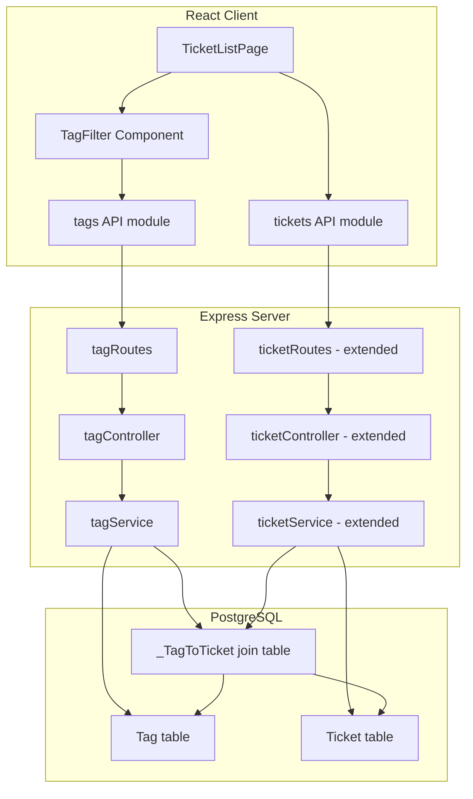
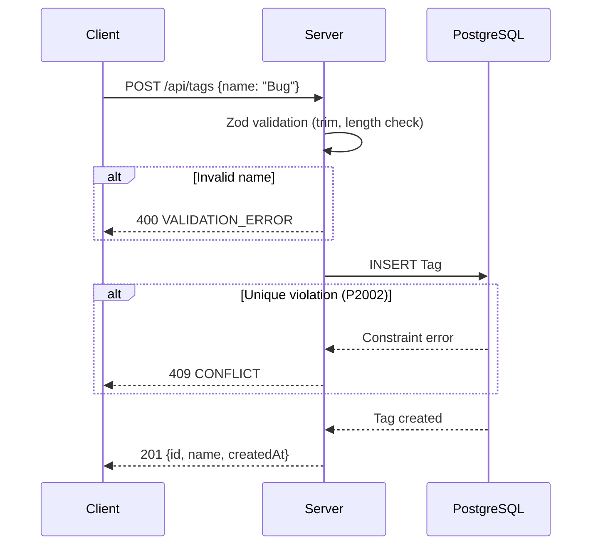

# Design Document: Ticket Tagging

## Overview

This feature introduces a **Tag** entity with a many-to-many relationship to **Ticket**, enabling staff to categorize tickets with reusable labels. It spans the full stack: Prisma schema changes, new REST endpoints for tag CRUD, modifications to ticket endpoints for attach/detach/filter, a new `TagFilter` UI component on the ticket list page, and seed data updates.

The design follows the existing project conventions:
- Server: `routes → controllers → services → Prisma`
- Client: `pages / components / api` with typed fetch wrappers
- Validation: Zod schemas on server, mirrored types on client
- Testing: Jest + Supertest (server), Vitest (client), fast-check for property-based tests

## Architecture



### Key Design Decisions

1. **Implicit many-to-many via Prisma**: Use Prisma's implicit relation syntax (`tags Tag[]` / `tickets Ticket[]`) which auto-generates a `_TagToTicket` join table. This avoids a manually managed join model while still getting cascading deletes.

2. **Replace semantics for tag assignment**: When updating a ticket's tags, the entire set is replaced rather than using add/remove operations. This simplifies both the API contract and the client logic — the client always sends the complete desired tag set.

3. **OR logic for tag filtering**: When filtering tickets by tags, any ticket matching _at least one_ selected tag is returned. This is more intuitive for categorization (users typically want "show me bugs OR features").

4. **Case-insensitive uniqueness via database collation**: The tag name unique constraint uses PostgreSQL's `CITEXT` extension or a `lower()` unique index to enforce case-insensitive uniqueness at the DB level rather than application level.

5. **Reuse existing `useDebounce` hook**: The 300ms debounce for tag filter changes reuses the existing `useDebounce` hook already present in the client codebase.

## Components and Interfaces

### Server Components

#### New Files

| File | Purpose |
|------|---------|
| `server/src/routes/tagRoutes.ts` | Express router for `/api/tags` endpoints |
| `server/src/controllers/tagController.ts` | Request handling for tag CRUD |
| `server/src/services/tagService.ts` | Business logic for tag operations |
| `server/src/schemas/tagSchemas.ts` | Zod validation schemas for tag endpoints |

#### Modified Files

| File | Changes |
|------|---------|
| `server/prisma/schema.prisma` | Add `Tag` model, add `tags` relation to `Ticket` |
| `server/src/app.ts` | Register tag routes |
| `server/src/services/ticketService.ts` | Add tag filtering to `listTickets`, include tags in responses, handle tag attach/detach |
| `server/src/schemas/ticketSchemas.ts` | Add `tags` field to create/update schemas, add `tag` to query schema |
| `server/prisma/seed.ts` | Add tag seed data |

### Client Components

#### New Files

| File | Purpose |
|------|---------|
| `client/src/api/tags.ts` | Typed fetch wrappers for tag API |
| `client/src/components/TagFilter.tsx` | Tag chip selector component |

#### Modified Files

| File | Changes |
|------|---------|
| `client/src/api/types.ts` | Add `Tag` interface, extend `Ticket` with `tags`, add `TicketSearchParams.tag` |
| `client/src/api/tickets.ts` | Pass `tag` param in `listTickets` |
| `client/src/pages/TicketListPage.tsx` | Integrate `TagFilter` component |

### API Interfaces

#### Tag Endpoints

```
POST   /api/tags          — Create a tag
GET    /api/tags          — List all tags (alphabetical)
DELETE /api/tags/:id      — Delete a tag
```

#### Extended Ticket Endpoints

```
GET    /api/tickets?tag=id1,id2  — Filter tickets by tag (OR logic)
POST   /api/tickets              — Accept optional tags[] in body
PATCH  /api/tickets/:id          — Accept optional tags[] in body (replace semantics)
```

### Service Interfaces

```typescript
// tagService.ts
export async function createTag(name: string): Promise<Tag>;
export async function listTags(): Promise<Tag[]>;
export async function deleteTag(id: string): Promise<void>;
export async function validateTagIds(ids: string[]): Promise<string[]>; // returns invalid ids

// ticketService.ts (extended)
export async function listTickets(filters?: {
  keyword?: string;
  status?: Status;
  tagIds?: string[];
}): Promise<TicketWithTags[]>;

export async function createTicket(data: {
  // ...existing fields
  tags?: string[];
}): Promise<TicketWithTags>;

export async function updateTicket(id: string, data: {
  // ...existing fields
  tags?: string[];
}): Promise<TicketWithTags>;
```

### Client Component Interface

```typescript
// TagFilter props
interface TagFilterProps {
  selectedTagIds: string[];
  onSelectionChange: (tagIds: string[]) => void;
}
```

## Data Models

### Prisma Schema Addition

```prisma
model Tag {
  id        String   @id @default(uuid())
  name      String   @db.VarChar(50)
  createdAt DateTime @default(now())
  tickets   Ticket[]

  @@unique([name], map: "Tag_name_ci_key")
}

model Ticket {
  // ...existing fields
  tags      Tag[]
}
```

The unique constraint on `name` will be enforced case-insensitively via a migration that creates a unique index on `lower(name)`:

```sql
CREATE UNIQUE INDEX "Tag_name_ci_key" ON "Tag" (lower(name));
```

### Join Table (auto-generated by Prisma)

```sql
CREATE TABLE "_TagToTicket" (
  "A" UUID NOT NULL REFERENCES "Tag"("id") ON DELETE CASCADE,
  "B" UUID NOT NULL REFERENCES "Ticket"("id") ON DELETE CASCADE
);
CREATE UNIQUE INDEX "_TagToTicket_AB_unique" ON "_TagToTicket"("A", "B");
CREATE INDEX "_TagToTicket_B_index" ON "_TagToTicket"("B");
```

### Zod Schemas

```typescript
// tagSchemas.ts
export const createTagSchema = z.object({
  name: z.string()
    .trim()
    .min(1, 'Tag name is required')
    .max(50, 'Tag name must be at most 50 characters'),
});

export const deleteTagParamsSchema = z.object({
  id: z.string().uuid('Tag id must be a valid UUID'),
});

// Extended ticket schemas
export const tagIdsArraySchema = z.array(
  z.string().uuid('Each tag id must be a valid UUID')
).max(10, 'Maximum 10 tags per request');

// Extended listTicketsQuerySchema
export const listTicketsQuerySchema = z.object({
  keyword: z.string().optional(),
  status: z.nativeEnum(Status).optional(),
  tag: z.string().optional(), // comma-separated UUIDs
});
```

### Client Types

```typescript
// types.ts additions
export interface Tag {
  id: string;
  name: string;
  createdAt: string;
}

export interface Ticket {
  // ...existing fields
  tags: Tag[];
}

export interface TicketSearchParams {
  keyword?: string;
  status?: Status;
  tag?: string; // comma-separated tag IDs
}
```

## Correctness Properties

*A property is a characteristic or behavior that should hold true across all valid executions of a system — essentially, a formal statement about what the system should do. Properties serve as the bridge between human-readable specifications and machine-verifiable correctness guarantees.*

### Property 1: Case-insensitive tag name uniqueness

*For any* two tag name strings that are identical when compared case-insensitively, creating the first tag should succeed and creating the second should be rejected with a 409 conflict.

**Validates: Requirements 1.4, 2.2**

### Property 2: Tag name trimming on creation

*For any* valid tag name string surrounded by arbitrary leading/trailing whitespace, creating a tag with that input should succeed and the returned tag name should equal the trimmed version of the input.

**Validates: Requirements 2.1**

### Property 3: Invalid tag name rejection

*For any* string that is either composed entirely of whitespace characters or exceeds 50 characters after trimming, creating a tag with that input should be rejected with a 400 validation error.

**Validates: Requirements 2.3**

### Property 4: Alphabetical tag listing

*For any* set of tags in the system, the array returned by GET /tags should be sorted such that for every consecutive pair of tags (a, b), `a.name.toLowerCase() <= b.name.toLowerCase()`.

**Validates: Requirements 2.4**

### Property 5: Tag deletion preserves associated tickets

*For any* tag that is associated with one or more tickets, deleting that tag should remove all join table entries for that tag while leaving every associated ticket intact and retrievable.

**Validates: Requirements 1.5, 2.5**

### Property 6: Tag association on ticket creation

*For any* valid subset of existing tag IDs (size 1–10), creating a ticket with that tags array should result in the ticket being associated with exactly those tags — no more, no fewer.

**Validates: Requirements 3.1**

### Property 7: Replace semantics on ticket update

*For any* ticket with an existing set of tags and *for any* new valid set of tag IDs (size 0–10), updating the ticket with the new tags array should result in the ticket being associated with exactly the new set, completely replacing the previous associations.

**Validates: Requirements 3.2**

### Property 8: Invalid tag ID rejection on attach

*For any* array of tag IDs where at least one ID does not correspond to an existing tag, the create or update request should be rejected with a 400 error identifying all invalid IDs.

**Validates: Requirements 3.3**

### Property 9: Tag inclusion in ticket responses

*For any* ticket with associated tags, both the single-ticket GET and the list-tickets GET should include a `tags` array where each element contains `id`, `name`, and `createdAt` fields matching the associated tag records.

**Validates: Requirements 3.5, 3.6**

### Property 10: OR-logic tag filtering

*For any* non-empty set of valid tag IDs used as the `tag` query parameter, every ticket in the response should have at least one tag whose ID is in the filter set, and no ticket matching the filter should be excluded from the response.

**Validates: Requirements 4.1**

### Property 11: Filter AND composition

*For any* combination of tag filter with keyword filter and/or status filter, every ticket in the response should satisfy ALL active filter conditions simultaneously (tag OR match AND keyword match AND status match).

**Validates: Requirements 4.2, 4.3**

### Property 12: Non-existent tag IDs ignored in filter

*For any* tag filter containing a mix of valid and non-existent tag IDs, the results should be identical to filtering with only the valid IDs from that set.

**Validates: Requirements 4.5**

### Property 13: Seed idempotency

*For any* number of consecutive seed script executions on the same database, the final state (tag count, tag names, and tag-ticket associations) should be identical to the state after a single execution.

**Validates: Requirements 6.4**

## Error Handling

### Server-Side Errors

| Scenario | HTTP Status | Error Code | Details |
|----------|-------------|------------|---------|
| Tag name empty/whitespace-only/too long | 400 | VALIDATION_ERROR | Field-level Zod errors |
| Tag name already exists (case-insensitive) | 409 | CONFLICT | "Tag with this name already exists" |
| Delete tag with invalid UUID | 400 | VALIDATION_ERROR | "id must be a valid UUID" |
| Delete non-existent tag | 404 | NOT_FOUND | "Tag with id 'X' not found" |
| Tags array > 10 items | 400 | VALIDATION_ERROR | "Maximum 10 tags per request" |
| Tags array contains non-existent IDs | 400 | VALIDATION_ERROR | Lists each invalid ID |
| Tag query param contains > 10 IDs | 400 | VALIDATION_ERROR | "Maximum 10 tag filter IDs" |
| Prisma unique constraint violation (race condition) | 409 | CONFLICT | Caught via Prisma error code P2002 |

### Client-Side Error Handling

- **Tag list fetch failure**: `TagFilter` displays inline error message with a "Retry" button. The ticket list remains functional without tag filtering.
- **Ticket fetch failure with tag filter**: Existing `ErrorDisplay` component shows the error. Tag filter state is preserved so the user can retry or clear the filter.
- **Network errors**: Handled by existing `ApiError` class in `client.ts`.

### Error Flow



## Testing Strategy

### Unit & Integration Tests (Server)

- **Tag CRUD**: Jest + Supertest tests for each endpoint — happy paths, validation failures, conflict handling, 404/400 edge cases.
- **Ticket-Tag association**: Tests for create/update with tags, replace semantics, max limit enforcement.
- **Filtering**: Tests for tag filter alone, tag + keyword, tag + status, non-existent IDs, empty filter.
- **Seed idempotency**: Run seed twice against test DB, verify final state matches.

### Unit Tests (Client)

- **TagFilter component**: Vitest + Testing Library — renders tags, selection/deselection, clear control, error state, empty state.
- **API module**: Verify `listTickets` correctly constructs URL with tag parameter.
- **Integration with TicketListPage**: Tag selection triggers debounced refetch with correct params.

### Property-Based Tests

Property-based testing is appropriate for this feature because:
- Tag name validation involves string transformation (trim) and constraint checking across a large input space
- Filter logic (OR/AND composition) is a pure function operating on sets
- Replace semantics for tag associations is a well-defined algebraic property

**Library**: `fast-check` (already installed in both server and client `devDependencies`)

**Configuration**:
- Minimum 100 iterations per property test
- Each test tagged with: `Feature: ticket-tagging, Property {N}: {title}`

**Server PBT coverage** (Jest + fast-check):
- Property 1: Case-insensitive uniqueness
- Property 2: Name trimming
- Property 3: Invalid name rejection
- Property 4: Alphabetical ordering
- Property 7: Replace semantics
- Property 10: OR-logic filtering
- Property 11: AND composition
- Property 12: Non-existent IDs ignored

**Client PBT coverage** (Vitest + fast-check):
- URL param construction for tag filter (derived from Property 11)

### Test File Locations

Following the project convention of tests next to source:
- `server/src/services/tagService.test.ts` — Tag service property tests
- `server/src/services/ticketService.test.ts` — Extended ticket service property tests (filtering, association)
- `server/src/routes/tagRoutes.test.ts` — Tag endpoint integration tests
- `client/src/components/TagFilter.test.tsx` — TagFilter component tests
- `client/src/api/tickets.test.ts` — URL construction property tests

