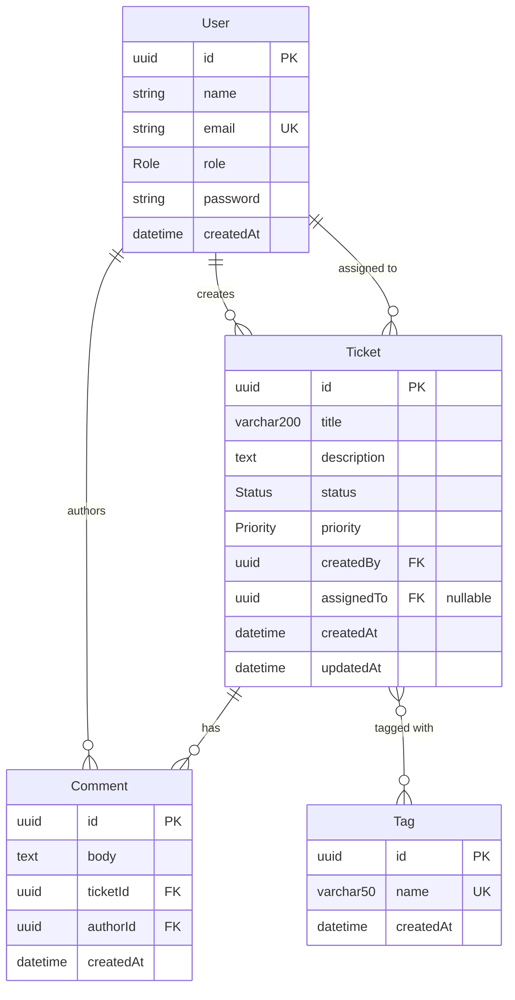
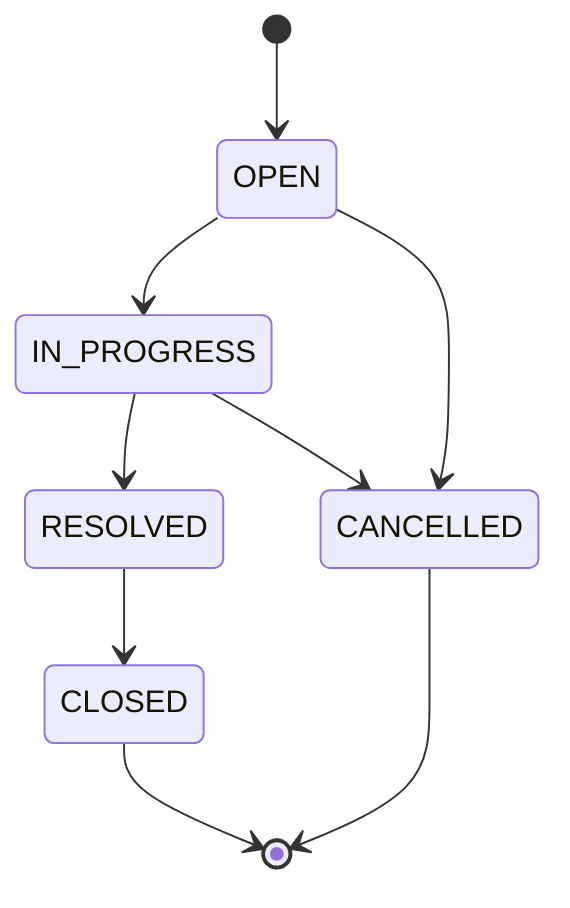

# Data Model

> Reconciled with the actual Prisma schema and migrations as implemented.

## Entity-Relationship Diagram



---

## Enums (Native PostgreSQL types)

### Status

```
OPEN | IN_PROGRESS | RESOLVED | CLOSED | CANCELLED
```

### Priority

```
LOW | MEDIUM | HIGH | URGENT
```

### Role

```
ADMIN | AGENT
```

---

## Models

### User

| Column | Type | Constraints | Notes |
|--------|------|-------------|-------|
| id | UUID | PK, auto-generated | |
| name | String | required | |
| email | String | unique | |
| role | Role (enum) | required | ADMIN or AGENT |
| password | VarChar(72) | required | Stored as bcrypt hash |
| createdAt | DateTime | auto-set on create | |

**Relations:**
- One-to-many → Tickets (as creator, via `createdBy`)
- One-to-many → Tickets (as assignee, via `assignedTo`)
- One-to-many → Comments (as author)

---

### Ticket

| Column | Type | Constraints | Notes |
|--------|------|-------------|-------|
| id | UUID | PK, auto-generated | |
| title | VarChar(200) | required | 3–200 chars enforced by Zod |
| description | Text | required | 1–5000 chars enforced by Zod |
| status | Status (enum) | default `OPEN` | Controlled by state machine |
| priority | Priority (enum) | required | |
| createdBy | UUID | FK → User.id, required | Immutable after creation |
| assignedTo | UUID | FK → User.id, nullable | Can be set/cleared via update |
| createdAt | DateTime | auto-set on create | |
| updatedAt | DateTime | auto-updated on row write | NOT touched by adding comments |

**Relations:**
- Many-to-one → User (creator)
- Many-to-one → User (assignee, nullable)
- One-to-many → Comments
- Many-to-many → Tags (implicit join table managed by Prisma)

---

### Comment

| Column | Type | Constraints | Notes |
|--------|------|-------------|-------|
| id | UUID | PK, auto-generated | |
| body | Text | required | 1–2000 chars enforced by Zod |
| ticketId | UUID | FK → Ticket.id, required | |
| authorId | UUID | FK → User.id, required | |
| createdAt | DateTime | auto-set on create | |

**Relations:**
- Many-to-one → Ticket
- Many-to-one → User (author)

**Important behavior:** Creating a comment does NOT update the parent ticket's `updatedAt` field. Only field edits and status changes touch `updatedAt`.

---

### Tag

| Column | Type | Constraints | Notes |
|--------|------|-------------|-------|
| id | UUID | PK, auto-generated | |
| name | VarChar(50) | unique (case-insensitive) | 1–50 chars enforced by Zod |
| createdAt | DateTime | auto-set on create | |

**Relations:**
- Many-to-many → Tickets (implicit join table `_TagToTicket`)

**Unique constraint:** Tag names are unique with a case-insensitive constraint (`Tag_name_ci_key`).

---

## State Machine

The ticket status lifecycle is enforced at the service layer via a single `Record<Status, Status[]>` transitions map.



**Terminal states:** `CLOSED`, `CANCELLED`  
- Tickets in terminal states reject all field updates (returns `TICKET_LOCKED`).  
- Comments are still allowed on terminal-state tickets.
- Status changes are restricted to users with the `ADMIN` role.

---

## Indexes

### GIN Trigram Index (Keyword Search)

A `pg_trgm`-based GIN index on `title || ' ' || description` enables efficient case-insensitive substring searches without sequential scans.

```sql
CREATE EXTENSION IF NOT EXISTS pg_trgm;

CREATE INDEX idx_ticket_search_trgm
  ON "Ticket"
  USING GIN (
    (title || ' ' || description) gin_trgm_ops
  );
```

Prisma's `contains` with `mode: 'insensitive'` generates `ILIKE '%keyword%'` SQL, which PostgreSQL's query planner serves via this GIN index.

---

## Migration History

| Migration | Purpose |
|-----------|---------|
| `20260719112909_init` | Create User, Ticket, Comment tables with enums |
| `20260719113000_add_trigram_search_index` | Add pg_trgm extension and GIN index |
| `20260719141756_add_tag_model` | Add Tag model with many-to-many relation to Ticket |
| `20260719153725_add_user_password` | Add password column to User for JWT auth |

---

## Key Design Decisions

1. **Native PostgreSQL enums** — Status, Priority, and Role are Prisma enums backed by `CREATE TYPE` statements. Not free-text strings.
2. **Foreign keys for user references** — `createdBy`, `assignedTo`, and `authorId` are FK references to `User.id`, not free-text names.
3. **Implicit many-to-many for tags** — Prisma manages the join table (`_TagToTicket`) automatically. Tag assignment uses set semantics on update (full replacement).
4. **Password storage** — bcrypt hash stored in a VarChar(72) column. Never returned in API responses.
5. **updatedAt isolation** — The `@updatedAt` directive only fires on direct Ticket row writes. Comment inserts go to a separate table and do not trigger it.
